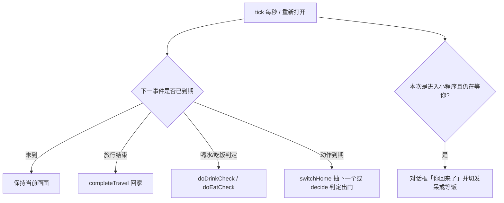
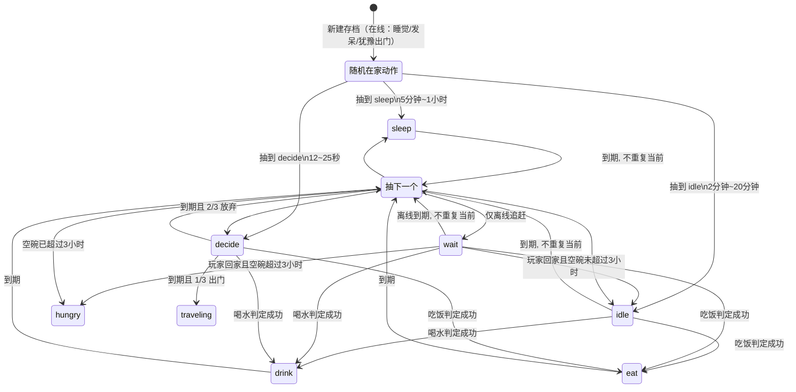

# 猫咪在家状态切换 & 旅行生命周期

本文基于当前代码实现整理（核心逻辑在 `miniprogram/utils/game.js`，首页驱动在 `miniprogram/pages/index/index.js`）。  
相对上一版实现的差异见《猫咪状态切换逻辑修改.md》。

---

## 1. 状态总览

猫咪同时受两套字段约束：

| 字段 | 含义 | 取值 |
| --- | --- | --- |
| `status` | 大状态：在家还是出门 | `home` / `traveling` |
| `activity` | 在家时的小动作 | `sleep` / `idle` / `wait` / `decide` / `hungry` / `eat` / `drink` |
| `activityEndAt` | 当前动作结束时间戳 | 毫秒 |
| `food` / `water` | 碗里剩余克数 | 每次喂 +10g，上限 50g |
| `travelStartedAt` / `travelEndAt` | 本次旅行起止时间 | 仅旅行中有效 |
| `lastTravelAt` | 上次出发时间 | 记录上次出门时刻 |
| `nextTravelCheckAt` | 下一次旅行判定时间 | 毫秒 |
| `emptySince` | 粮水都空的起始时间 | 碗非空则为 `0` |
| `idleKind` | 非发呆时的近景姿势 | `stand` / `lie` |
| `idleArt` | 发呆图片下标 | `0` ~ `4`，对应 5 张发呆素材 |
| `nextIdleArtAt` | 发呆中下次换图时间 | 仅 `idle` 时有效 |
| `poseVariant` | 同动作的图片变体 | `0` / `1` |
| `hasUnreadCard` | 是否有未读明信片 | boolean |
| `collectedCards` | 已收集明信片列表 | 数组，新卡插在最前 |

吃饭/喝水调度字段：`nextDrinkCheckAt`、`nextEatCheckAt`。

驱动入口是 `tick(state, now, templates, options)`：首页每秒调用一次，`onShow` 也会先 `tick` 一次再渲染。  
`tick` 会按事件时间循环追赶（睡觉结束、吃饭/喝水判定、`decide` 出门、旅行归来），因此**关小程序期间时间仍会流逝**。

---

## 2. 在家：动作类型

在家时猫咪可以处于以下 `activity`。旅行中首页不展示猫咪，也不再推进这些动作。

### 2.1 动作定义

| activity | 含义 | 持续时长（从开始到结束） | 位置 | 文案 | 图片 |
| --- | --- | --- | --- | --- | --- |
| `sleep` | 睡觉 | 随机 **5 分钟 ~ 1 小时** | 碗附近 `cat-near` | 睡觉中... | `sleep/001~003.png` 循环 |
| `idle` | 发呆 | 随机 **2 分钟 ~ 20 分钟** | 碗附近 `cat-near` | 发呆中... | 5 张图随机切换（含书包） |
| `wait` | 在门口等你 | 随机 **10 分钟 ~ 3 小时** | 门口 `cat-door` | 在等你~ | `wait-1.png` / `wait-2.png` |
| `decide` | 犹豫要不要出门 | 随机 **12 ~ 25 秒** | 门口 `cat-door` | 要出门吗... | 同 wait |
| `hungry` | 等饭 | 随机 **10 分钟 ~ 3 小时** | 碗附近 `cat-near` | 等饭中... | 站/躺，不带背包 |
| `eat` | 吃饭 | 随机 **2 ~ 5 分钟** | 碗附近 `cat-near` | 吃饭中... | `eat/001~003.png` 循环 |
| `drink` | 喝水 | 随机 **1 ~ 3 分钟** | 碗附近 `cat-near` | 喝水中... | 站/躺，不带背包 |

补充：

- `wait` 和 `decide` 都算「在门口」：`atDoor = activity === "wait" || activity === "decide"`。
- 睡觉帧按绝对时间循环，不绑定本次睡觉的起点：`001 → 002 → 003 → 002`，每帧 1 秒。
- 吃饭帧同样按绝对时间循环：`001 → 002 → 003 → 002`，每帧 1 秒。
- `hungry` 会出现在：玩家回家触发「你回来了」且空碗已超过 3 小时；或日常轮换时已空碗超过 3 小时。

### 2.2 图片怎么选

`getCatSrc` 的优先级：

1. `sleep`：睡觉序列帧
2. `wait` / `decide`：门口背影 `wait-{1|2}.png`
3. `eat`：吃饭序列帧
4. `idle`：从下面 5 张里随机，**与粮水无关**；进入发呆时先抽一张，之后每隔 **8 ~ 20 秒**再换一张（不立刻重复当前这张）：
   - `lie-1.png`
   - `lie-2.png`
   - `lie-bag.png`
   - `stand-bag.png`
   - `stand.png`
5. 其余（`hungry` / `drink`）：`stand.png` 或 `lie-1.png` / `lie-2.png`，不带书包

喂食只改碗，**不立刻改 activity**（若当前是 `hungry` 则例外，会切到发呆并重新随机发呆图）。离线追赶时若发呆图到期，只补切一次，不会把中间每一张都演一遍。

---

## 3. 在家：切换规则

### 3.1 一次动作如何落地

`applyActivity(state, activity, now, durationMs?)`：

1. 写入新的 `activity`
2. `activityEndAt = now + 时长`（未传入时长则按上表随机）
3. `poseVariant` 随机 `0` 或 `1`
4. `idleKind` 以 50% 概率选 `stand` 或 `lie`
5. 若新动作是 `idle`，`idleArt` 从 5 张发呆图中随机一张，并写入下一次换图时间 `nextIdleArtAt`

### 3.2 下一个动作怎么抽

日常轮换候选默认是：`sleep`、`idle`、`decide`。  
**玩家在线时（正在小程序里）不会抽到 `wait`。**  
离开小程序后再打开时，追赶离线时间才把 `wait` 放进池子。

- 若粮水都空 **且** 空碗已持续 **大于 3 小时**，再把 `hungry` 加进池子。
- 从池子里**剔除当前动作**，避免连续两次相同。
- 若剔除后为空，则退回完整池子。
- 最后等概率随机一个。

`eat` / `drink` **不进日常轮换**，只由吃饭/喝水判定插入。到期后仍走上面的轮换（同样不会立刻再抽到刚刚结束的那个日常动作）。

### 3.3 到期后的总开关 `switchHome`

当前动作时间到了，且仍在家：

- 若当前是 `decide`：**1/3 概率**真正出门（走旅行分档与消耗）；**2/3 概率**放弃，再抽下一个日常动作。
- 其余动作：抽下一个动作，再 `applyActivity`。

独立的 `nextTravelCheckAt` 定时出门已不再驱动 tick。

### 3.4 「你回来了」

首页 `onShow` 若判定本次是**进入小程序**（`App.onShow`：冷启动或从后台回来，不是从相册返回），且追赶时间后猫咪仍是 `wait`：

1. `tick(..., { enteringApp: true })` 标记 `welcomeBack`
2. 首页 `wx.showModal`，标题「你回来了」
3. 后续状态：
   - 粮水都为 0，且 `now - emptySince > 3 小时` → `hungry`（等饭中...）
   - 否则 → `idle`（发呆中...）

全新安装第一次打开不弹（还没有存档 / 没离开过）。之后再进小程序，只要猫还在门口等，就会弹。

### 3.5 初始与喂食

**新建存档 `createState`**

- `food = 0`，`water = 0`，`status = home`，`emptySince = 现在`
- 旅行字段清零
- 安排第一次喝水判定（2~3 小时后）和吃饭判定（5~6 小时后）
- 从 `sleep / idle / decide` 里随机一个作为第一个动作（新建时玩家已在线，不会是「在等你」）

**喂食 `feed`**

- 粮或水未达到 **50g** 就可以继续喂
- 每点一次「喂」，粮、水各 +10g，分别封顶 50g
- 喂完后若碗不再全空，清掉 `emptySince`
- 若当前是 `hungry`，喂完立刻改成 `idle`

### 3.6 在家切换时序

文案优先级（`getStatusText`）：

1. 旅行中 → `旅行中~`
2. 睡觉 → `睡觉中...`
3. 吃饭 → `吃饭中...`
4. 喝水 → `喝水中...`
5. 门口 decide → `要出门吗...`
6. 门口 wait → `在等你~`
7. hungry → `等饭中...`
8. 其余（idle）→ `发呆中...`

---

## 4. 吃饭 / 喝水

- 下一次喝水判定：当前起 **2~3 小时**
- 下一次吃饭判定：当前起 **5~6 小时**

判定时若正在睡觉或旅行：睡觉会把判定推迟到睡醒之后；旅行期间不处理吃饭/喝水，回家后再追赶。

每次判定：

1. 对应物资为 0（吃饭看粮、喝水看水）→ **不当作吃/喝**，只预约下一次判定。
2. 否则 **1/3 概率**真的吃/喝，**2/3 概率**跳过。
3. 抽中时消耗 **5~10g** 随机（不超过碗里剩余）。
4. 然后切到短状态：吃饭约 2~5 分钟「吃饭中...」，喝水约 1~3 分钟「喝水中...」。

没有 24 小时次数保底。扣完后若粮水都空，写入 `emptySince`。

---

## 5. 旅行：开始

### 5.1 触发条件

玩家**没有「出门」按钮**。猫咪在日常轮换里抽到 `decide`（门口犹豫 12~25 秒）后：

- **1/3 概率**真正出门，按时长分档扣粮水并进入旅行
- **2/3 概率**放弃，再抽下一个日常动作（不会立刻再抽到 `decide`）
- 粮或水不足 10g 也可以出门（低档，出发时耗尽剩余）
- 睡觉中不会抽到出门，必须先醒过来进入 `decide`

已不再用 `nextTravelCheckAt` 做独立定时出门。

### 5.2 时长与消耗

硬性上限：单次旅行不超过 **48 小时**。

| 出发时物资存量 | 旅行时间 n | 出发消耗结算 |
| --- | --- | --- |
| 粮或水 < 10g（低档） | 30 分钟 ~ 6 小时 | 消耗掉剩余的所有粮、水后出发 |
| 粮、水都 ≥ 10g（中档） | 1 小时 ~ 12 小时 | 若 n > 6 小时，则消耗 10g 粮、10g 水；否则不扣 |
| 粮、水都 ≥ 20g（高档） | 2 小时 ~ 24 小时 | 若 n > 12 小时：粮 20g、水 10g；若 6 小时 < n ≤ 12 小时：各 10g；否则不扣 |

分档从高到低匹配。高档在 n ≤ 12 小时时的扣减，是按中档规则补全的（需求只写了 n > 12 小时那一行）。

出发瞬间：

1. 按上表扣粮、水
2. `status = "traveling"`
3. `travelStartedAt = now`，`lastTravelAt = now`
4. `travelEndAt = now + n`（n 不超过 48 小时）
5. **不改 `activity`**（首页已不渲染猫）

出发后首页表现：

- 猫咪图片隐藏
- 文案 `旅行中~`
- 中央：「它出门了」+「已出门 XX 分钟」+ 剩余倒计时  
  - 不足 1 小时：`m:ss`  
  - 达到 1 小时：`h:mm:ss`

---

## 6. 旅行：进行中

`tick` 一旦发现 `status === "traveling"`，只处理旅行结束，不推进在家动作和吃饭/喝水。

- `now < travelEndAt`：保持原 state，返回剩余毫秒 `remainMs`
- 首页定时器每秒刷新倒计时和已出门分钟
- 已出门分钟：`floor((now - travelStartedAt) / 60000)`

关小程序后再打开：

1. `store.load()` 读本地 `travel_cat_state_v1`
2. `normalize` 校验字段（`status` 只认 `traveling`，否则当 `home`）
3. 立刻 `tick`：若旅行尚未结束，继续显示倒计时；若已结束，走回家结算

---

## 7. 旅行：返回

当 `now >= travelEndAt`，`tick` 调用 `completeTravel`，并标记 `completed: true`。  
首页会 toast「它回来了」。

### 7.1 结算步骤

1. 用本次 `travelStartedAt` / `travelEndAt` 作为行程区间  
   （缺省时：结束时间用 `now`，开始时间用 `结束时间 - 5 分钟`，仅用于旧明信片）
2. `pickTrip` 抽一张明信片模板：优先有真实照片；尽量避开上一张卡的 `templateId`
3. `makeCard` 生成新卡（`journaledAt` 落在行程区间内）
4. 写回家状态：`status = home`，清掉本次旅行起止，`hasUnreadCard = true`，新卡插到最前
5. 抽一个新的在家动作（避开当前 activity；刚回来也可以睡觉 / 发呆 / 犹豫出门；离线追赶时还可以在等你；空碗超过 3 小时则可能等饭）

### 7.2 明信片未读

- 回家后相册角标亮点：`hasUnreadCard`
- 打开相册页时会再 `tick` 一次，然后 `clearUnread`

### 7.3 再次出门

回家后不会立刻再出发：刚结束的 `decide` 会被防重剔除，必须再轮换一轮才可能再次犹豫出门。  
碗空时仍可能出门（低档，出发耗尽剩余）。喂食只影响库存分档和日常吃饭/喝水，不再是出门的硬开关。

---

## 8. 关键时间常量

| 常量 | 值 | 用途 |
| --- | --- | --- |
| `PORTION_G` | 10 | 每次点击喂食，粮、水各加 10g |
| `FEED_CAP_G` | 50 | 粮、水投喂上限 |
| `MEAL_CHANCE` | 1/3 | 判定时真的吃/喝的概率 |
| `MEAL_CONSUME_*` | 5~10g | 抽中吃/喝时的随机消耗 |
| `SLEEP_*` | 5 分钟 ~ 30 小时 | 单次睡觉 |
| `IDLE_*` | 2 分钟 ~ 10 分钟 | 单次发呆 |
| `IDLE_ART_*` | 5 ~ 8 分钟 | 发呆中途换姿势 |
| `WAIT_*` | 10 分钟 ~  30 分钟 | 单次在等你 |
| `DECIDE_*` | 12 ~ 25 秒 | 单次出门前犹豫 |
| `TRAVEL_CHANCE` | 1/2 | `decide` 到期后真正出门的概率 |
| `EMPTY_HUNGRY_MS` | 3 小时 | 空碗超过此时长可进入等饭 |
| `TRAVEL_MAX_MS` | 48 小时 | 单次旅行上限 |
| `LOW_TRAVEL_*` | 30 分钟 ~ 6 小时 | 低档旅行时长 |
| `MID_TRAVEL_*` | 1 小时 ~ 12 小时 | 中档旅行时长 |
| `HIGH_TRAVEL_*` | 2 小时 ~ 24 小时 | 高档旅行时长 |
| `TRAVEL_DURATION_MS` | 5 分钟 | **仅旧明信片缺开始时间时回填**，不是当前旅行时长 |

随机整数是闭区间：`min + floor(random * (max - min + 1))`。

---

## 9. 页面如何驱动这些逻辑

首页 `pages/index/index.js`：

| 时机 | 行为 |
| --- | --- |
| `onShow` | `load` → `tick({ enteringApp })` → 渲染；旅行归来 toast「它回来了」；若 `welcomeBack` 则弹「你回来了」 |
| 每 1 秒 | 再 `tick`：有状态变化则整份 apply（在线时不会抽到「在等你」）；旅行中刷新倒计时和已出门分钟；睡觉/吃饭中只刷新帧 |
| 点「喂」 | `feed`，成功则存档并刷新碗；发呆图不因粮水变化而切换 |
| `onHide` / `onUnload` | 停定时器 |

`App.onShow` 在冷启动或从后台回来时记下「进入小程序」，首页用 `takeEnteringApp()` 消费这次标记。从相册返回不会再次标记。全新安装第一次打开不弹「你回来了」。

权威存档在微信云开发（环境 `cloud1-4grqnt5f5b5d8f20`）：`users` / `players` / `cards`。时间以服务器为准，出发时锁定 `travelId`。本地只缓存上次结果。  
旧本地档 `travel_cat_state_v1` 在首次 `login` 时只迁移库存和明信片。旧存档若只有 `pose: "sleep" | "wait"`，`normalize` 会迁到新的 `activity` 字段。`activity: "decide"` 会保留。

完整存储说明见《多用户存储与时间线.md》。

---

## 10. 一条完整生命周期（示例）

1. 新猫在家，碗空，在睡觉 / 发呆 / 门口犹豫出门之间切换（在线时不会去「在等你」）；离线追赶才可能「在等你」。单次动作可持续数分钟到数小时，且不会连续两次相同。
2. 玩家点击「喂」→ 粮、水各 +10g，最多喂到 50g。当前动作通常不变；若正在等饭则改为发呆。
3. 之后每隔 2~3 小时判定一次喝水、每隔 5~6 小时判定一次吃饭：碗空则跳过，否则 1/3 概率发生，消耗 5~10g。
4. 日常轮换抽到 `decide` 时，猫会在门口犹豫 12~25 秒，然后 **1/3 概率**出门。粮水都 ≥ 10g 时走中档时长；不足则短途出门并带光剩余物资。
5. 旅行中猫从画面消失，展示「它出门了」「已出门 XX 分钟」和剩余时间，最长 48 小时。
6. 倒计时结束（或稍后打开小程序时发现已到点）→ 生成一张明信片，角标未读，猫咪回家。
7. 若玩家离开小程序再回来，正好碰到猫咪在门口等，会弹出「你回来了」：空碗已超过 3 小时则等饭，否则发呆。玩家在线时不会随机切到「在等你」。
8. 回家后，系统再找一个 1 分钟 ~ 24 小时内的随机时间判定下一次旅行。
